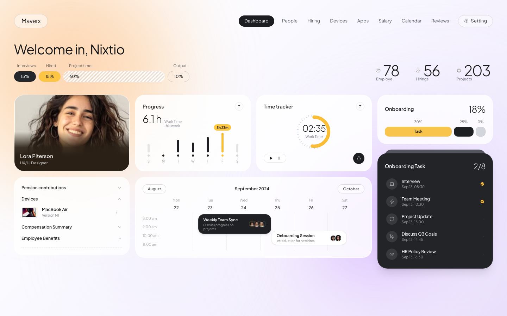

# maverxdashboard

A modern, ultra-refined HR & project management dashboard featuring animated ambient mesh gradients, interactive time tracking, schedule calendar, and glassmorphic UI components.



## ✨ Features
- **Animated Dual-Tone Ambient Gradients**: GPU-accelerated floating mesh orbs in sunset orange (top-left) and vivid purple/lavender (right/bottom).
- **Interactive Time Tracker**: SVG tachymeter gauge with play/pause stopwatch controls.
- **Glassmorphic UI**: Translucent frosted cards (`backdrop-blur`) that dynamically refract ambient background lighting.
- **Onboarding Workflow**: Interactive task checklist with real-time status counters.
- **Weekly Schedule Matrix**: Multi-day calendar view with team sync and onboarding sessions.
- **Responsive & Full-Sized**: Fluid layout built with React, Vite, TypeScript, and Tailwind CSS.

## 🚀 Getting Started

### Prerequisites
- Node.js 18+ and npm

### Installation
```bash
git clone https://github.com/Mikey01-ui/maverxdashboard.git
cd maverxdashboard
npm install
npm run dev
```

### Build for Production
```bash
npm run build
npm run preview
```
